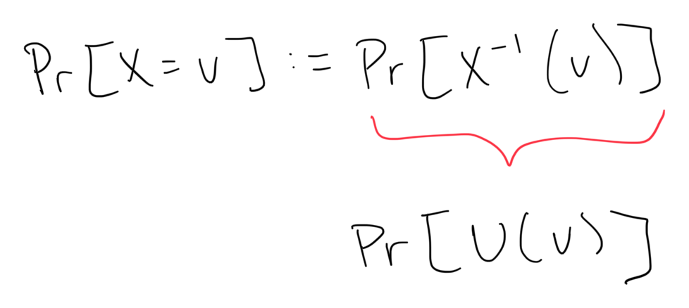

A random variable is a function `X` that maps from `U` to a subset `V`

The probability that the function `X` equals a particular value `v` is the same as the probability of sampling that value `v` at random from the pre-image set of `X` (the input set, in this case we mean `U`)

> The probability of choosing a value from *the function `X` should be indistinguishable from choosing that same value from the universe `U` at random*

