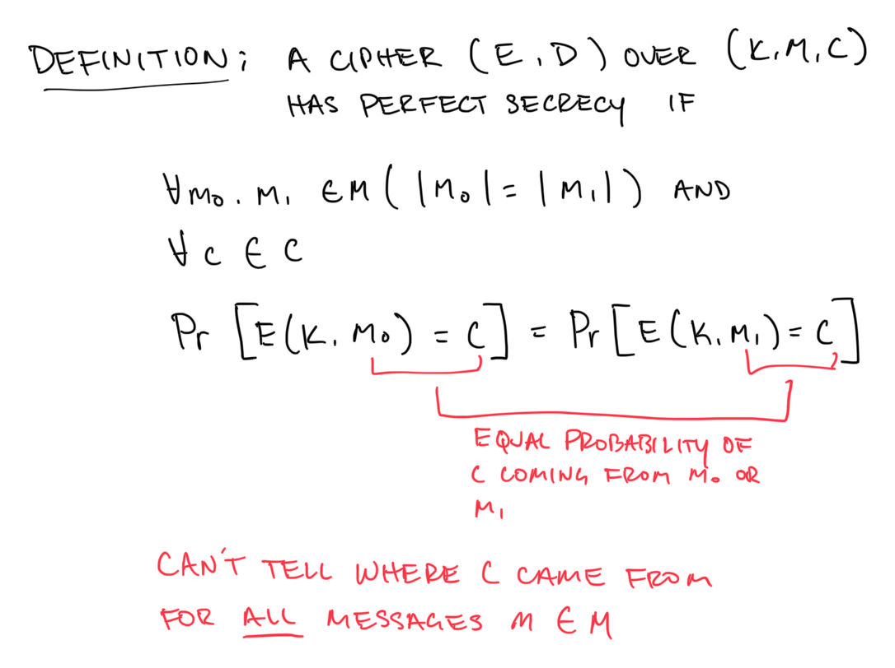

**Definition**: A [Cipher](@/garden/cryptography/cipher.md) (E,D) over (K, M, C) has **perfect secrecy** if

`for all m_0, m_1 in M (m_0 length = m_1 length) and for all cipher texts in C the probability Pr[E(k,m_0) = c] = Pr[E(k,m_1) = c]`

**Meaning**: If an attack sees our cipher text `c` , the probably that the original message was `m_0`  or `m_1` is **the same**. So the attack has no idea what the original message would have been!

