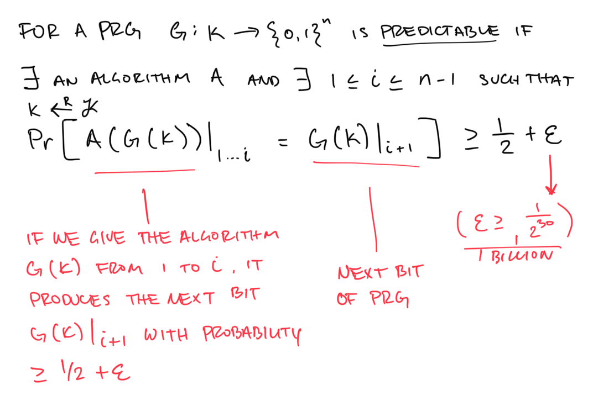

A PRG is **unpredictable** if for all bits `i` there does not exist and efficient algorithm `A` which can guess the `i+1` bit of the PRG for non-negligible `epsilon` .

A PRG is **unpredictable** if it is **NOT predictable**

---

A PRG is **predictable** if there exists an efficient algorithm `A`  - and there exists an `i` between `1 → (n-1)`  - such that if we give the algorithm `A` the first `i` bits out the output, it can predict the next bit, or bit `i+1` with some probability greater than or equal to `1/2 + epsilon` .

`for random k from K; Pr[A(G(k))|(1…i) = G(k)|(i+1)] >= 1/2+ epsilon`

