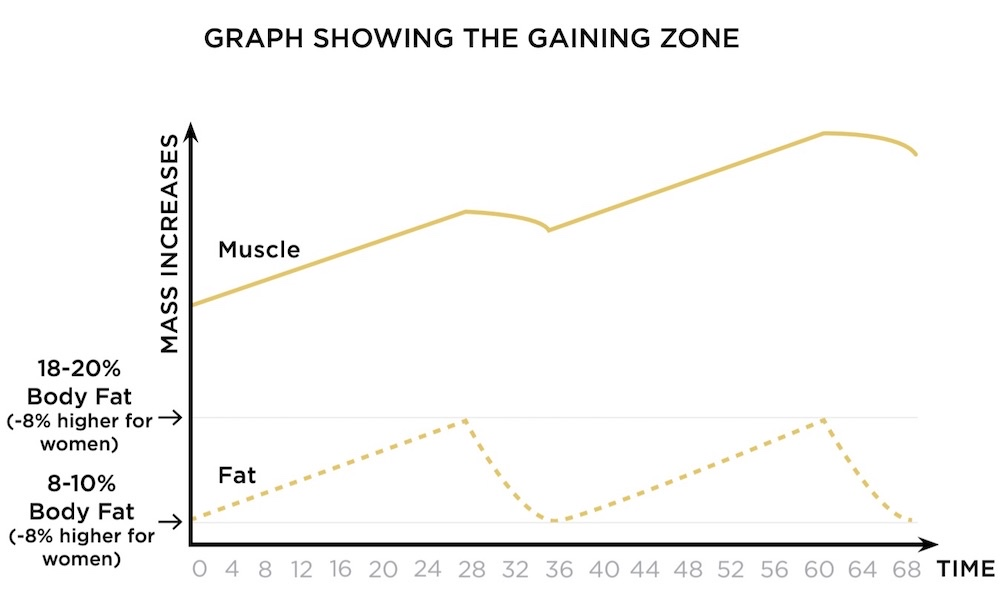

# Cutting

> *Cutting is a fat loss phase. It required a calorie deficit to accomplish*

> Choose to cut if you canary a large amount of body fat, regardless of your level of training experience.

- Minimum body fat to cut to is about 10%. Below which there are marginal gains and the effort is too hard.
- The body does not want to be exepectionally lean, it is a threat to survival.
- Ideal is 10%

# Bulking

> The correct term would be “gaining” which is putting on weight in the form of muscle and fat.

> Choose to gain if you are underweight or are already lean enough to see your abs and wish to get bigger

- Maximum body fat for bulking is around 20%
- Don’t bulk if you are already at 16% body fat
- Ideal is 15%

# Recomp

> Body recompositioin is simultaneous muscle gain and fat loss while eight remains stable

> Choose a body recomp if you are relatively new to training or are coming back after a long break

- If you are weak and soft to the touch despite tensing your muscles you are “skinny fat”. This means you are not overweight but your body composition is has more fat than muscle. Consider a recomp.
- Slowly gaining: about 1% of your body weight per month
- Slowly cutting: about 0.5% of your body weight per month

---

#### References

[Should I Bulk vs Cut? The Definitive Guide | RippedBody.com](https://rippedbody.com/cut-or-bulk/)

