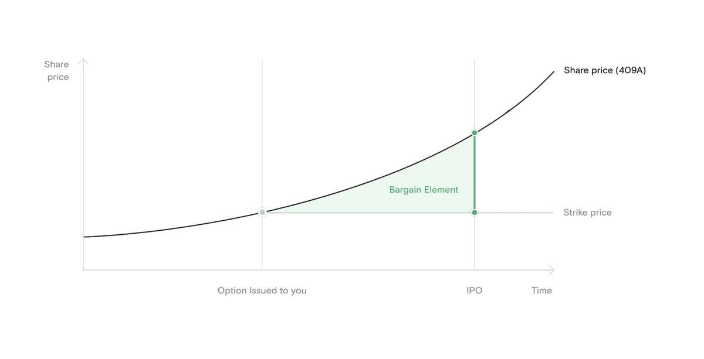

### Basics of Stock Options

Privately held companies have two valuation, a [Preferred Valuation](@/garden/startup-equity/preferred-valuation.md) and a [Fair Market Value (409A)](@/garden/startup-equity/fair-market-value-409a.md). When getting equity in a startup, usually via [Stock Options](@/garden/startup-equity/stock-options.md), the value of those options will be the 409a valuation not the preferred valuation.

Companies will receive new [Preferred Valuation](@/garden/startup-equity/preferred-valuation.md)s each time it raises a [Priced Round](@/garden/startup-equity/priced-round.md).

When joining a company you will receive a number of shares which are accessible to you via [Stock Options](@/garden/startup-equity/stock-options.md). The percentage of the company you own:

`Your Stock Options /` [Fully Diluted Shares Outstanding (FDSO)](@/garden/startup-equity/fully-diluted-shares-outstanding-fdso.md)

Example: `500,000 / 10,000,000 = 5%`

As the company grows, [Dilution](@/garden/startup-equity/dilution.md) will occur and your ownership will decrease. This is because new stock will be issued to new investors as the company grows as requires more capital.

[Dilution](@/garden/startup-equity/dilution.md) is not always bad but may be balanced with a [Refresher Grant](@/garden/startup-equity/refresher-grant.md) to give more equity to early employees. Even as your equity in the company gets diluted, the valuation of the company ideally increases. This means that your shares will be worth a greater dollar amount then when you first received them.

Over time you will unlock the **right to purchase stock options** in your startup in a process called [Vesting](@/garden/startup-equity/vesting.md). Typically vesting works on a schedule, for example: *4 years with a 1 year cliff* means that 25% of the options granted to you will be available after 1 year of remaining at the company.

The price you pay to purchase your stock options at the time of vesting is called the [Strike Price](@/garden/startup-equity/strike-price.md). The strike price is the company's 409a valuation divided by the number of shares in the company at the time you were granted the options.

Example:

**409a Valuation**: `$35,000,000`

**Number of Shares**: `43,750,000`

**Strike Price**: `$0.80 per share`

As time goes on, the [Fair Market Value (409A)](@/garden/startup-equity/fair-market-value-409a.md) of your company will increase, the difference between the strike price and the higher 409a price is called the [Bargain Element](@/garden/startup-equity/bargain-element.md).

Once you purchase the options, you own them, however you cannot sell them since they are stock options in a private company. There is no public market to sell them on. Therefore there is a tradeoff to purchasing options

**Reasons Not to Purchase Options and Wait**

1. Risky investment. If the company goes under you lose a job and lose your personal investment
2. You may not have the money to afford to exercise (purchase stock via an option) as well the money to cover taxes on that purcahse
3. Taxes can be high when exercising and/or selling

There are two kinds of tock options, [Non-Qualified Stock Options (NSO)](@/garden/startup-equity/non-qualified-stock-options-nso/index.md) and [Incentive Stock Options (ISO)](@/garden/startup-equity/incentive-stock-options-iso/index.md).

With [Non-Qualified Stock Options (NSO)](@/garden/startup-equity/non-qualified-stock-options-nso/index.md)

1. On Exercise - you pay ordinary income tax on  `409a price - strike price`
2. When selling, you pay capital gains on `sale price - 409a price at time of exercise`

With [Incentive Stock Options (ISO)](@/garden/startup-equity/incentive-stock-options-iso/index.md)

1. On Exercise - no ordinary income tax. But you may trigger [Alternative Minimum Tax (AMT)](@/garden/startup-equity/alternative-minimum-tax-amt.md) if the [Bargain Element](@/garden/startup-equity/bargain-element.md) amount from the ISO exercise exceeds the [Alternative Minimum Tax (AMT)](@/garden/startup-equity/alternative-minimum-tax-amt.md) exemption amount.
AMT payment is due at the time of tax filing.
2. Anything you pay towards AMT is a credit you may recover in years where your AMT taxable amount is less than your ordinary taxable income. (*there is no guarantee this will happen in future years*)

There is an important tax benefit if you own stock at a startup company. The IRS provides a [Qualified Small Business Stock (QSBS)](@/garden/startup-equity/qualified-small-business-stock-qsbs.md) tax exemption. If you hold stock for at least five years and the company which offered you that stock never had more than $50 million in assets up until the issuance then your stock may qualify.
If the stock qualifies, you may receive a capital gains tax exemption of either (i) $10 million (ii) 10x the original investment. This can mean 0% capital gains tax.

The benefits of exercising earlier (rather than later) include kickstarting the LTCG and QSBS clocks and locking in a lower bargain element at the time of exercise to reduce tax exposure As your equity scales in value, so do the raw tax benefits—can be worth millions in savings

Some companies allow you to do something called an *early exercise*. This allows you to purchase your options *before* they vest, kickstarting the clocks even sooner and limiting tax exposure because the bargain element is lower.

- Make sure you file something called an "83(b) election” to lock in the tax benefit. This is basically a pledge to the IRS stating that you want to be taxed on the *current* valuation of your options, rather than the higher valuation at a later date. In order to avoid having to pay tax on the *bargain element*, you must send the 83(b) election postmarked no later than 30 days after the date of the stock purchase.

When leaving a startup there will be a [Post-Termination Window](@/garden/startup-equity/post-termination-window.md), typically of 90 days, where you can purchase your options, afterwards the options will expire.

# Startup Offers

**Here are some of the key terms you’ll want to understand:**

- The type (**ISOs, NSOs, RSUs**), quantity, **vesting terms**, and **strike price** of your options.
- The latest **409a valuation, preferred price**, and the **total number of fully diluted shares**.
- The **exercise window** and if you are able to early exercise your shares.

**Questions to Ask**

- What percentage of the company do my shares represent in proportion to the number of fully diluted shares outstanding?
- What was the latest 409a valuation and when is the next one expected?
- Have you raised capital with greater than a [1x liquidation preferences](https://medium.com/@CharlesYu/the-ultimate-guide-to-liquidation-preferences-478dda9f9332#:~:text=A%201x%20liquidation%20preference%20means,common%20shareholders%20are%20paid%20anything.&text=For%20a%202x%20multiple%2C%20you,common%20shareholders%20are%20paid%20anything.)?
- Do you allow for early exercise?
- What is the exercise window for employees?
- Is there a double trigger clause? (If not, then the founder can restart your vesting after an acquisition.)
- Can I sell my exercised stock on the secondary market? (Some companies don’t allow this.)

---

#### References

[GitHub - jlevy/og-equity-compensation: Stock options, RSUs, taxes — read the latest edition: www.holloway.com/ec](https://github.com/jlevy/og-equity-compensation)

[What I Wish I'd Known About Equity Before Joining A Unicorn](https://gist.github.com/yossorion/4965df74fd6da6cdc280ec57e83a202d?permalink_comment_id=1978599)

[YC Startup Talks: Startup Equity with Compound (YC S19)](https://www.youtube.com/watch?v=Jpem6ZqWHt8&t=1624s)

[Qualified Small Business Stock (QSBS) Tax Benefit | Carta](https://carta.com/blog/qsbs/)

