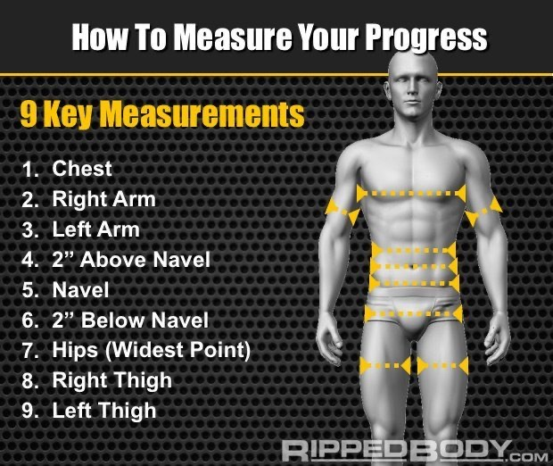

# Tracking Mistakes

1. **Do you try to gauge progress by how you look in the mirror?**

   Bad idea. The brain plays tricks on us by adapting perceptions to new levels of stimulation through a phenomenon known as “perceptual adaptation.” Oh and how defined you look condition will change from day to day your water balance and gut content fluctuate.

1. **Are you trying to measure your body fat percentage?**

   Well, that’s another seemingly great, but really bad idea. Body fat measurement methods *all* have accuracy and consistency issues. (I’ve written more about this here: [US Navy Body Fat Calculator](@/garden/weightlifting/us-navy-body-fat-calculator.md)

   Over longer time frames, this is sufficient. In the shorter time frames where all the decisions need to happen, this is woefully inadequate, and will more than likely just leave you in the shit.

1. **Are you weighing yourself just once per week?**

   Don’t do that. Your weight will fluctuate from day to day, and across the course of a day.

# Interpreting Measurement Data

> You can only reasonably gauge progress over a four week period.
You’re looking for a minimum confirmation that you’re progressing, not any single point in the data that you are not.

### When Bulking

1. When above 15% body fat, fat will be added to the lower abs before being added to the upper abs.
2. All of your measurements will increase, some of this will be fat. This is expected.
3. An increase in neck girth is a good indicator of lean muscle mass gain as this area of your body does not store very much fat.

   > Only compare this over long time intervals

   [US Navy Body Fat Calculator](@/garden/weightlifting/us-navy-body-fat-calculator.md)

### When Cutting

1. Fat is stored on your chest, back, arms, and legs. **If your measurements decrease it is not necessarily muscle loss.**
2. When lower than 15% body fat. Fat will come off of the upper abs before the lower abs.

[US Navy Body Fat Calculator](@/garden/weightlifting/us-navy-body-fat-calculator.md)

1. ## Weigh Yourself Every Morning Upon Waking Up (Record Weekly Average)

   Scale weight will fluctuate from day to day. You can expect to see changes of up to 1-2% throughout the day and between days.

   > Weigh yourself in the morning, after using the toilet, everyday

1. ## Take Circumference Measurements in Nine Places - Once Per Week

   + List of Measurement Locations
      1. Chest
      2. Right Arm
      3. Left Arm
      4. Above Navel 5cm / 2in
      5. At Navel
      6. Below Navel 5cm / 2in
      7. Hips (widest point)
      8. Right Thigh
      9. Left Thigh

   > Measure yourself in the morning, once per week on Saturday, after using the toilet.

   ### Tips for taking measurements

   1. Get a Myottape/Orbitape
   2. Tense your muscles
   3. Use the widest part of your legs
   4. Measure at the nipple line for the chest

         *Ensure the tape measure is level and not twisted on your back*

   1. Curl your biceps in a pose to take your arm measurement at the widest point
   2. To gauge 5cm/2in above and below the navel use three ginger finger widths
3. ## Take Two Photos, Front, Side, Back Once Every Four Weeks

   Taking photos every four weeks is a good time frame because progress may be noticable on that timescale.

   Taking photos is a subjective collection and helpful for seeing progress but is not data and should not be used to make decisions.

1. ## Note Adherence to Weekly Calorie Targets Along with Weight

   Whether muscle or fat was gained over the week is determined by the adherence to calorie targets.

   > Use this data in conjunction with weight in order to determine what type of weight was put on and why.

1. ## Note Training Adherence as a Percentage of the Number of Workouts Completed Each Week

   This figure is how well you are adhering to your workout schedule.

   > If this number is consistently below 80% (missing one in five workouts) then you need to re-prioritize your schedule

1. ## Track Subjective Feelings of Sleep Quality, Stress Levels, Hunger, and Fatigue Each Week

   ::Sleep:: 0-5

   ::Stress:: 0-5

   ::Hunger:: 0-5

   ::Fatigue:: 0-5

1. ## Keep Summary Notes on Your Key Lifts

   Every two weeks record one of the following three states to describe each of your main compound lifts

   ::Progressing | Recovered::

   ::Not Progressing | Recovered::

   ::Not Progressing | Not Recovered::

   Progressing: Means you can accomplish the added weight

   Not Progressing: Means you are not accomplishing added weight

   Recovered: Means the weights don’t feel heavier than usual

   Not Recovered: Means the weight do feel heavier than usual

1. ## Keep a Detailed Training Log

#### References

[How To Track Your Physique Progress](https://rippedbody.com/diet-progress-tracking/)

