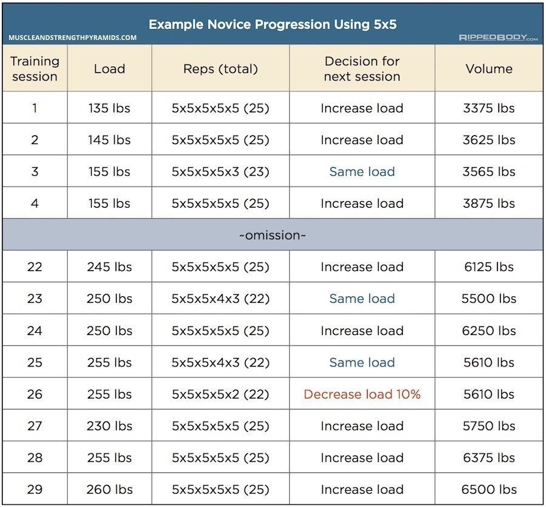

Weightlifting is the process of stressing muscles by forcing them to contract (resistance) with added weight. Applying the principal of [Progressive Overload](@/garden/weightlifting/progressive-overload.md)

# Novice Weightlifting

This program uses an Upper / Lower split routine for beginners to allow for greater resting time between workouts and not cause depletion. It is important to [Warm Up Before Strength Training](@/garden/weightlifting/warm-up-before-strength-training.md) in order to increase performance and reduce injury.

For a novice, it is important to have good [Exercise Selection](@/garden/weightlifting/exercise-selection.md), this is because we don't want to overwork ourselves with too many exercises and variation. Focus on [Compound Exercises](@/garden/weightlifting/compound-exercises.md) with some supporting [Isolation Exercises](@/garden/weightlifting/isolation-exercises.md).

# Workout Schedule

::2 ON:: | ::1 OFF:: | ::2 ON:: | ::2 OFF::

Strength | Strength | Volume | Volume

# Progression

Progressing refers to the ability and plan to add more weight to exercises. We want to progress because increased weight provides more tension for muscles when performing reps. For now we will be using a [Linear Weightlifting Progression](@/garden/weightlifting/linear-weightlifting-progression.md) which adds a constant (linear) amount of weight to each exercise after each workout.

It is essential to keep track of the number of reps, weight used, and progression decision for each exercise during each workout. An example progression might look something like this

## Advice

1. Do not get frustrated with yourself and add weight to the bar when you shouldn’t.
2. Don’t be afraid to lift a little less if you need to.
3. Always lift with good form so that you stay safe.
4. Do not go to form failure so that you don’t get injured.

# Body Recomposition

[How to Lose Fat AND Gain Muscle at the Same Time (3 Simple Steps)](https://www.youtube.com/watch?v=rkv1fpWLy0Q&feature=youtu.be)

1. Eat below maintenance calories by 5-20%
2. Emphasis on high protein high carb low fat diet
3. Time meals before and after workout
4. Spread protein intake throughout the day

# References

[The Novice Bodybuilding Sample Program](https://rippedbody.com/novice-bodybuilding-program/)

[The Science of How to Build Muscle: Full Guide](https://www.julian.com/guide/muscle/intro#how-much-muscle)

