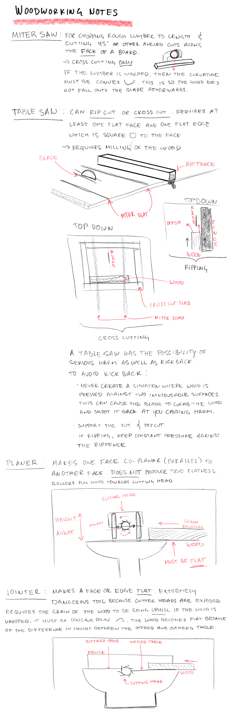
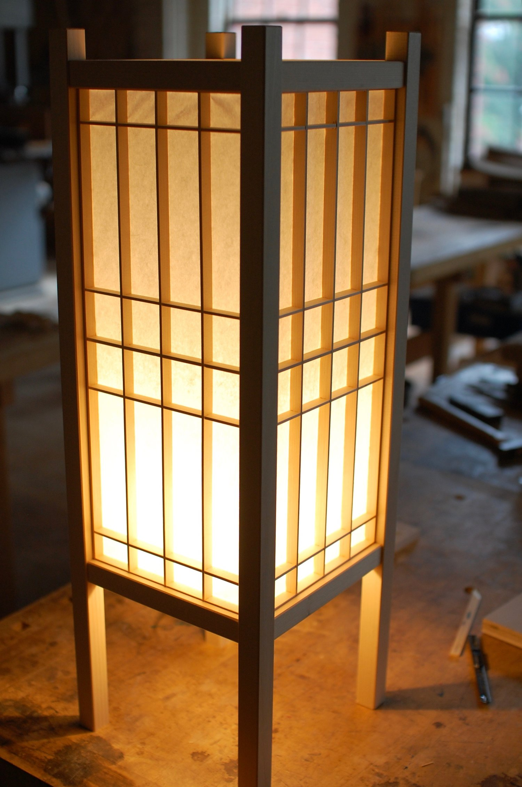

# Woodworking Tools

# Router Notes

- The bit needs to be 75% into the collet
- If the bit bottoms out, the friction will send the bit flying

# Woodworking Basic's - Notes

### Physical Properties of Wood

_bin_preview.png)

# Port Orford Cedar - Relative to Hinoki

(Chamaecypars lawsoniana)

[Overland Journal — THE RYOVAN ](https://www.ryovan.com/overland-journal)

# Workshop Storage cabinet dimensions

11" wide x 24" deep x 48" tall

But there is a support which makes the effective height 45.75"

# Shoji Lamp

# Bread Box

# Bread Board w/ Crumb Catcher

[Bread Cutting Board // Woodworking Project // DIY Project](https://www.youtube.com/watch?v=JI6KjThoUGc)

# Plywood Storage Cabinet

[DIY Drawer Cabinet | Drawer Making and Installation // Plans available](https://www.youtube.com/watch?v=wvOgRfc0Rhk)

   - Need a pocket hole jig somehow (does the workshop have this?)

[How to Finish Plywood Cabinets: Inside & Out | Sealing Plywood / Edge Banding / Painting Plywood](https://www.youtube.com/watch?v=eYJafURctT4)

   - how to finish a plywood cabinet
   - requires
      - wood filler
      - edge banding
      - primer
      - paint
      - other stuff to coat the unpainted insides of the drawer

[install simple plunger lock on wood drawer of filing cabinet](https://www.youtube.com/watch?v=YyScjrRclL4)

[Caster wheels 2 in](https://www.homedepot.com/p/Everbilt-2-in-Black-Soft-Rubber-and-Steel-Swivel-Plate-Caster-with-Locking-Brake-and-90-lbs-Load-Rating-49509/203661074?)

[Everbuilt 22 in soft close drawer slide](https://www.homedepot.com/p/Everbilt-22-in-Soft-Close-Full-Extension-Side-Mount-Ball-Bearing-Drawer-Slide-Set-1-Pair-2-Pieces-D94222E-ZP-W/302867630)

[The fast and easy half-half-half drawer construction method](https://www.youtube.com/watch?v=HQXHzvJNsoA)

   Try using the half-half-half method for cutting dados and rabbets into the walls of the plywood to avoid using a pocket jig and allow for 1/2 in plywood sides and 1/4 in plywood bottom.

[How to Make Dead Simple Drawers - No Nails and No Screws](https://www.youtube.com/watch?v=C7_bmT8r6zk)

   Second video on the topic of half-half-half which shows how to assemble the final drawer.

