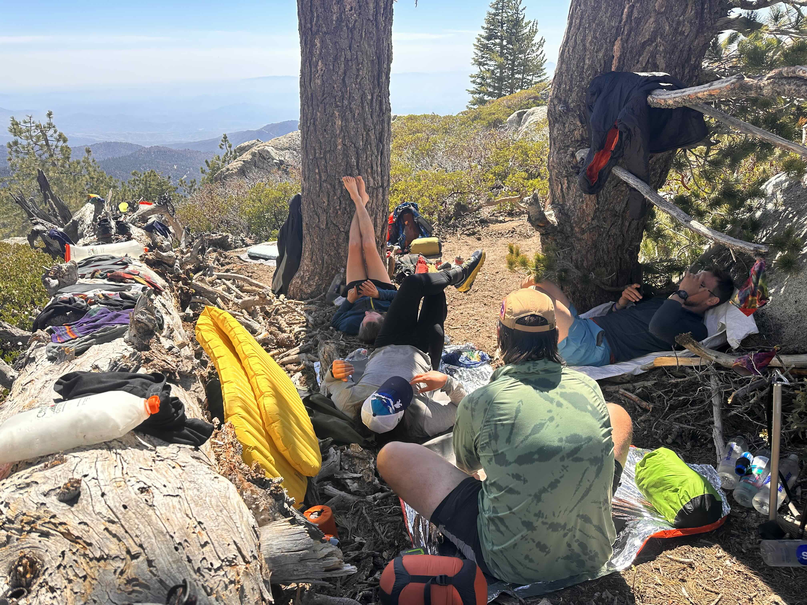
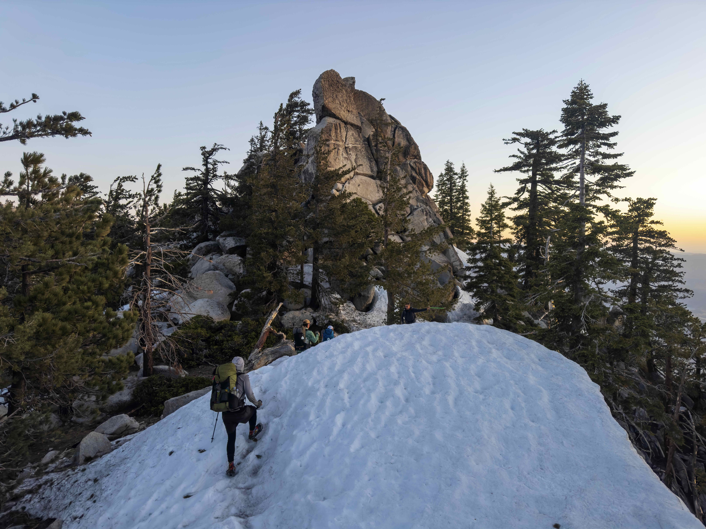
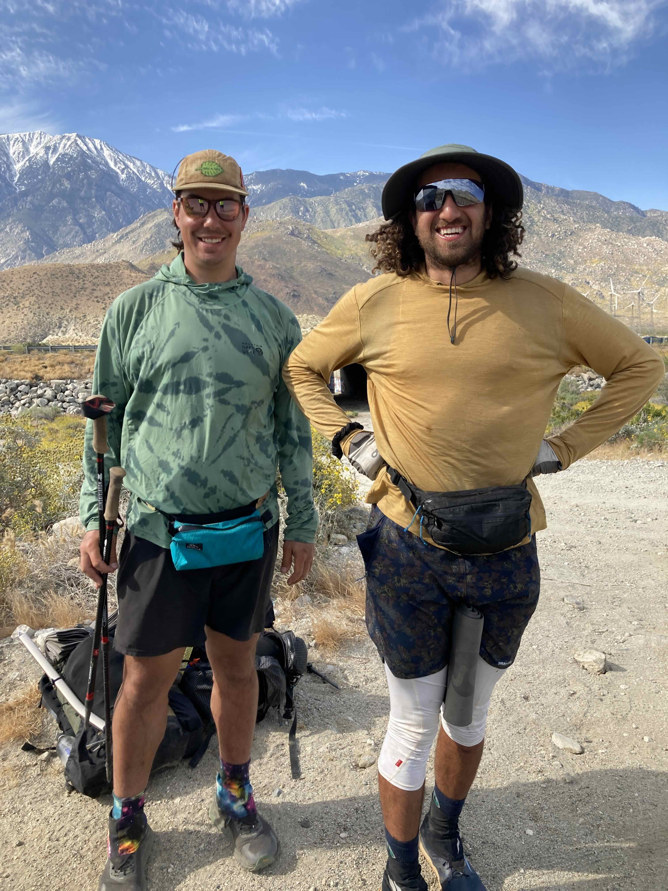

+++
title = "Recurse 1 - Dealing with Burnout, Thru-Hiking, and Back Again"
date = 2023-09-22
+++

This is a summary of my first week at [The Recurse Center](https://recurse.com),
which is a 12-week retreat for programmers. The retreat aims to allow
programmers to challenge themselves and "work at the edge of their abilities".
The Recurse Center operates on a self-directed basis, meaning there are no
classes or curriculum to follow. Each participant is responsible for creating
their own schedule and can join or create interest groups with fellow
batchmates.

### Brain Goes 'Burn Out'

I experienced burnout during the past year due to a combination of factors. My
personal life was not going well, and after years of working remotely, I reached
a point where I was totally unsatisfied with my work, professional success, and
environment. I want to express my gratitude to my coworkers at Keybase/Zoom
during this time. They were all amazing and handled the acquisition with great
professionalism. Although I wish the circumstances were different, I am
extremely grateful for their support and what we accomplished.

Burnout is an interesting thing, I knew about it from the frequent discussions
in the technology community as well as the collective experience during the
pandemic. However knowing and feeling are two entirely different experiences
and I found myself with a lack of outlets and support. Unlike many others the
pandemic did not make me feel claustrophobic. Despite spending three years in a
small New York City apartment. Eventually, the computer no longer provided the
escape it once did, so I began looking for something more.

### Thru-Hiking

<figcaption>Yours truly got the trail name "Bamba" after the Israeli snack food he
carried with him, and his matching yellow shirt</figcaption>

This journey began with a single video on YouTube titled ["Two Years on a
Bike](https://www.youtube.com/watch?v=rY0i2wUmIak)". Seeing Martijn's journey
sparked something in my brain that had been under-stimulated. I realized that I
was not making the most of my life, and time was slipping away. At the beginning
of this year, I made the choice to hike the [Pacific Crest
Trail](https://en.wikipedia.org/wiki/Pacific_Crest_Trail). I documented my
journey through [my travel blog](https://jakeby.land), but I ended up not
completing the trail due to a torn quadriceps after 37 days of hiking.

I can write about the PCT for pages. Endless trail stories, characters met,
disasters overcome, and friendships forged. This is not the post for those
stories, I may write a retrospective on the trail soon, but the most important
thing worth mentioning is this: the trail community was pure, loving, kind,
ambitious, and most of all smelly.

We slept in tents, sometimes directly on the dirt, we walked every day - always
north, we ate and ate and ate, then ate some more. We saw stars, swam in rivers
and hot springs, lamented the scorching desert heat, and the freezing nights. We
cried, nursed our blisters and wounds, said goodbye to friends, made new ones.
We supported each other, loved one another, and laughed - so much laughter.

I miss those friends I made on trail every day, and I have the honor of seeing
several of them complete their thru-hike today.

### Arriving at RC

Getting to Recurse has been on my list for several years now. RC entered my
radar with either a blog post or a conversation from one of the many alumni I
have followed, such as my former co-worker and Keybaser [Chris
Ball](https://printf.net/), not to mention [Julia Evans](https://jvns.ca/), as
well as [Filippo Valsorda](https://filippo.io/).

Being effectively homeless while walking the Pacific Crest Trail then coming
home to nothing was a wake up call. I realized I could either put my engineering
hat back on and try for startups or corporations again, or I could take a few
more steps back and use the time I allocated for the trail to continue self
reflecting.

It became clear to me that I wanted to have a fresh experience with programming
again. I needed a revival of my love for coding, computers, technology and an
exercism of sorts for my cynicism around my field. In late August I tried
interviewing again while simultaneously applying for RC, I let those two race
each other, whichever completed first would win. So I went to RC

### First Day of School

There is a certain kind of nervous energy after returning to classes after a
long summer of play. The Recurse Center is no different. The first week was ripe
with new faces, new ideas, and testing the waters to see if any of these other
people are as weird as me. Turns out, they are, and there are heaps of quirky
weekly discussion groups, impromptu pairing sessions, and creative coding.

I decided to commit to learning about my fellow batchmates and their interests
before hitting the ground running on my personal projects and goals at RC. In
theory I could be building something interesting on my own at any time, but a
being included in rich circle of curious programmers does not happen every day.
There are several people currently at RC with overlapping interests in
cryptography, Rust, lower level systems, and fancy web tech. Now I know I won't
be the odd ball.

The facilitators at RC do an excellent job making everyone feel welcome and have
a keen sense of what we need to get started. In the first week I was able to
join a 'Rust Books Crew' as well as revive some interest in the [Cryptopals
challegnes](https://cryptopals.com).

### What I'll Work On

Here's the big idea: I have enjoyed working on security and cryptography over
the past several years, but I have not had the opportunity or time to take a
deeper dive into cryptography engineering. My overall goal is to work on
building up my cryptography knowledge my implementing primitives from the ground
up whenever possible. Additionally my programming experience up until now have
been with [Garbage
Collected](https://en.wikipedia.org/wiki/Garbage_collection_(computer_science))
languages like Go, JavaScript/TypeScript, Ruby, and Python. In University I
steered clear of the C/C++ track because I did not trust myself to write memory
safe code and was more interested in producing things for the web where garbage
collected languages rain supreme.

#### Rust, Memory Management, and Concurrency

- Read through [Rust for Rustaceans](https://nostarch.com/rust-rustaceans) by
  [Jon Gjengset](https://thesquareplanet.com/)
- Dive into native Rust multi-threading (thread spawning, joining, and channels)
- Use [tokio](https://tokio.rs/) for a project (here be dragons)
- Understand [atomic memory
  orderings](https://doc.rust-lang.org/std/sync/atomic/enum.Ordering.html)
  (which are effectively C++ 20's memory orderings)
- Get very comfortable with
  [Arc](https://doc.rust-lang.org/std/sync/struct.Arc.html),
  [Mutex](https://doc.rust-lang.org/std/sync/struct.Mutex.html),
  [RwLock](https://doc.rust-lang.org/std/sync/struct.RwLock.html), etc.

####  Cryptography Fundamentals

- Implement either
  [XChaCha20Poly1305](https://en.wikipedia.org/wiki/ChaCha20-Poly1305) or
  [AES](https://en.wikipedia.org/wiki/Advanced_Encryption_Standard) from scratch
- Build and compile a [Merkle Tree](https://en.wikipedia.org/wiki/Merkle_tree)
  explorer to [Web Assembly](https://webassembly.org/) and host it
- Complete, ideally, all of the [Cryptopals challenges](https://cryptopals.com)
- Finish my reading of [Real-World
  Cryptography](https://www.manning.com/books/real-world-cryptography) by David
  B. Wong

#### Encrypted Filesystem

- While at Keybase I was not able to work directly on
  [KBFS](https://book.keybase.io/files), Keybase's end to end encrypted
  filesystem. I was a heavy user naturally and can happily describe it a magic.
  Totally effortless, secure, and pleasant to use.
- Why no re-implement the magical
  [FUSE](https://en.wikipedia.org/wiki/Filesystem_in_Userspace) part of KBFS in
  Rust as a learning exercise while at RC?
- I have no desire or intention to re-implement the key exchange, social proofs,
  or discoverability necessary to make KBFS work the way it did, however it
  would be nice to tackle [End to End
  Encryption](https://en.wikipedia.org/wiki/End-to-end_encryption) for file
  systems.
- Big question: can I cross compile the core file system cryptography to Web
  Assembly to it can run in the browser while also enabling nice system
  integration via FUSE?

#### More Web Projects 

I learned that I am a 'show don't tell' type of programmer. I enjoy telling
computers how to build something I can show to another person, the visual or
interactive nature of a web application is a great manifestation of this. Today
everyone has a universally compatible browser which can run web applications,
this is nothing short of magical and we forgot it daily. The web is a fantastic
ecosystem and it deserve more panache than SEO, E-commerce, and banking. I have
a few ideas in this domain I hope to write about soon.

#### Writing, Speaking, Presenting

Those who know me would not describe me a shy, but perhaps private. I have taken
my public presence seriously by not having one. I think my thesis in life,
especially on the internet, is to [Keep a Low Profile](@/writing/keep-a-low-profile/index.md).
Yet, we learn and grow by putting ourselves 'out there', to make a statement publicly and hear back 
from the void "you suck!"

At least amongst the people at the Recurse Center, the tone is friendly,
forgiving, and most of all accepting of vulnerability. Many of my batchmates are
switching careers into tech and I fully support them, if they can make blog
posts about what they are learning so can I! Thanks for the encouragement
everyone.

#### Spontaneity!

Many people at RC will write a semi-daily checkin via Zulip. Reading these
checkins are a constant source of connection, pair programming, and inspiration.
Checkins are great for "chaotic distractive creativity" because often times a
single statement by a peer will lead to hours of fruitful conversation. For
those who attended a university, it is directly equivalent to overhearing or
walking in on intellectual conversation in classrooms and hallways.

### After My Batch

Using Rust at work and at scale is my biggest technical goal after my time at
Recurse. I am sold entirely on its ability to produce fast, safe, and
multi-platform code. It is a true [Hyrdo-Dynamic Spatula with port and starboard
attachments and turbo drive](https://www.youtube.com/watch?v=rOHaBw7XlzA). Rust
also has a strong future in Cryptography, especially thanks to its memory
safety. Equally as important, I hope to find an excellent group of people to
work with. There are several companies on my radar whose culture matches what I
am looking for. We shall see how this assessment holds up in 12 weeks. In the
mean time excited for what is to come!
